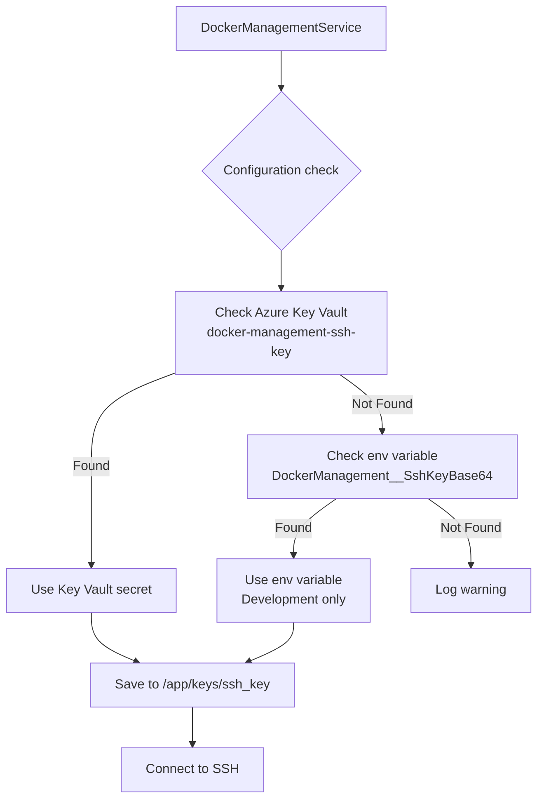

# Azure Key Vault SSH Key Setup

Bu dokümanda SSH key'i güvenli bir şekilde Azure Key Vault'a ekleme adımları açıklanmıştır.

## Genel Bakış

SSH key'i doğrudan Coolify environment variable'larında saklamak yerine, Azure Key Vault'ta saklıyoruz. Bu yaklaşım:
- ✅ Daha güvenli (Key Vault şifreli)
- ✅ Merkezi yönetim
- ✅ Audit trail
- ✅ Rotasyon kolaylığı

## Adım 1: Sunucudan SSH Key'i Alın

### Sunucuya bağlanın ve key'i görüntüleyin:

```bash
# Sunucuya SSH ile bağlanın
ssh root@95.217.219.4

# SSH key'i görüntüleyin (yeni oluşturmak için önceki dokümanlara bakın)
cat ~/.ssh/docker_management_key

# veya mevcut key'i kullanın
cat ~/.ssh/id_rsa
```

**ÖNEMLİ**: Key içeriğini kopyalayın ve güvenli bir yere (örn: notepad) yapıştırın.

## Adım 2: SSH Key'i Lokal Dosyaya Kaydedin

Windows'ta:
1. Notepad açın
2. SSH key içeriğini yapıştırın
3. `ssh_key.txt` olarak kaydedin (örn: `C:\temp\ssh_key.txt`)

## Adım 3: Azure Key Vault'a Ekleyin

### Otomatik Yöntem (PowerShell Script):

```powershell
# Script'i çalıştırın
cd deployment
.\add-ssh-key-to-keyvault.ps1

# Sizden SSH key dosya yolunu isteyecek
# C:\temp\ssh_key.txt yazın
```

### Manuel Yöntem (Azure CLI):

```bash
# Azure'a login olun
az login

# SSH key'i Key Vault'a ekleyin
az keyvault secret set \
  --vault-name stocker-kv-prod \
  --name docker-management-ssh-key \
  --file C:\temp\ssh_key.txt
```

### Azure Portal Yöntemi:

1. [Azure Portal](https://portal.azure.com) açın
2. **Key Vaults** → **stocker-kv-prod** gidin
3. **Secrets** → **Generate/Import** tıklayın
4. Şu bilgileri girin:
   - **Name**: `docker-management-ssh-key`
   - **Secret value**: SSH key içeriğini yapıştırın
   - **Content type**: `text/plain`
5. **Create** tıklayın

## Adım 4: Key Vault Konfigürasyonunu Doğrulayın

### Uygulama Azure Key Vault'a bağlı mı kontrol edin:

```bash
# Secret'ı görüntüleyin (sadece metadata)
az keyvault secret show \
  --vault-name stocker-kv-prod \
  --name docker-management-ssh-key \
  --query "id"
```

### Coolify'da Environment Variable Kontrolü:

Coolify'da şu environment variable'ların OLMAMASI gerekiyor:
- ❌ `DockerManagement__SshKeyBase64` (Bunu kaldırın)

Sadece bunlar kalmalı:
- ✅ `DockerManagement__SshHost` = `95.217.219.4`
- ✅ `DockerManagement__SshUser` = `root`
- ✅ `AZURE_KEY_VAULT_ENDPOINT` = `https://stocker-kv-prod.vault.azure.net/`

## Adım 5: Test Edin

1. Uygulamayı deploy edin
2. Logları kontrol edin:
   ```
   "SSH key loaded from Azure Key Vault"
   ```
3. `/dashboard/system/docker-stats` sayfasını açın

## Kod Akışı



## Güvenlik Notları

### ✅ Yapılması Gerekenler:
- SSH key'i sadece Azure Key Vault'ta saklayın
- Key Vault access policies'i kontrol edin
- Düzenli key rotasyonu yapın (3-6 ayda bir)
- Audit loglarını kontrol edin

### ❌ Yapılmaması Gerekenler:
- SSH key'i Git'e commit etmeyin
- Key'i plain text olarak environment variable'da saklamayın
- Key'i public paylaşımlarda kullanmayın

## Sorun Giderme

### "Secret not found" Hatası
```bash
# Secret'ın var olduğunu kontrol edin
az keyvault secret list --vault-name stocker-kv-prod

# İsmi kontrol edin (tam olarak "docker-management-ssh-key" olmalı)
```

### "Access denied" Hatası
```bash
# Service Principal'in Key Vault'a erişimi var mı kontrol edin
az keyvault show --name stocker-kv-prod --query "properties.accessPolicies"
```

### SSH Bağlantı Hatası
- Key formatını kontrol edin (line ending'ler önemli)
- Permission'ları kontrol edin (Key 600 permission'a sahip olmalı)

## Temizlik

Test SSH key dosyasını silin:
```powershell
Remove-Item C:\temp\ssh_key.txt -Force
```

## Özet

1. ✅ SSH key sunucudan alındı
2. ✅ Azure Key Vault'a eklendi
3. ✅ Uygulama otomatik olarak Key Vault'tan alıyor
4. ✅ Coolify'da ekstra konfigürasyon gerekmiyor
5. ✅ Güvenlik en üst seviyede