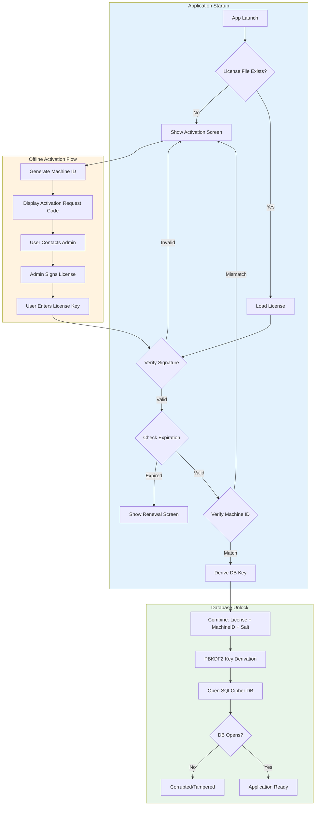

# Stocker Desktop - Security & Licensing Architecture

## Executive Summary

This document defines the security architecture for Stocker Desktop, covering:
- Hardware-locked licensing with offline activation
- SQLite database encryption with SQLCipher
- Application hardening against reverse engineering
- Tamper-proof audit logging
- Secure admin/technician mode

---

## 1. Architecture Overview



---

## 2. Licensing System

### 2.1 Machine ID Generation

The Machine ID is derived from multiple hardware identifiers to ensure:
- **Persistence**: Survives OS reinstalls
- **Uniqueness**: Distinct per physical machine
- **Resilience**: Tolerates minor hardware changes

**Components Used:**
| Source | Weight | Persistence |
|--------|--------|-------------|
| Motherboard Serial | High | Excellent |
| CPU ID | High | Excellent |
| BIOS UUID | Medium | Good |
| Primary Disk Serial | Medium | Good |
| MAC Address (first NIC) | Low | Fair |

**Algorithm:**
1. Collect all available hardware identifiers
2. Normalize and concatenate
3. Apply HMAC-SHA256 with app-specific salt
4. Take first 32 chars as Machine ID

### 2.2 License Key Structure

License keys are **signed JWTs** with the following payload:

```typescript
interface LicensePayload {
  // Identification
  lid: string;              // License ID (UUID)
  mid: string;              // Machine ID (hardware fingerprint)
  cid: string;              // Customer ID
  cname: string;            // Customer Name

  // Validity
  iat: number;              // Issued At (Unix timestamp)
  exp: number;              // Expiration (Unix timestamp)

  // Features
  modules: {
    inventory: boolean;
    sales: boolean;
    crm: boolean;
    hr: boolean;
    finance: boolean;
    purchase: boolean;
  };

  // Limits
  maxUsers: number;
  maxProducts: number;
  maxWarehouses: number;

  // Type
  type: 'trial' | 'standard' | 'professional' | 'enterprise';
}
```

**Signature**: Ed25519 asymmetric signature
- Private key: Stored only on license server
- Public key: Embedded in application (safe to distribute)

### 2.3 Offline Activation Workflow

```
┌─────────────────┐     ┌─────────────────┐     ┌─────────────────┐
│   Client App    │     │   User/Admin    │     │  License Server │
└────────┬────────┘     └────────┬────────┘     └────────┬────────┘
         │                       │                       │
         │ 1. Generate Request   │                       │
         │──────────────────────>│                       │
         │   (Machine ID +       │                       │
         │    Customer Info)     │                       │
         │                       │                       │
         │                       │ 2. Submit Request     │
         │                       │──────────────────────>│
         │                       │                       │
         │                       │                       │ 3. Verify Customer
         │                       │                       │    Generate License
         │                       │                       │    Sign with Private Key
         │                       │                       │
         │                       │ 4. Return License Key │
         │                       │<──────────────────────│
         │                       │                       │
         │ 5. Enter License Key  │                       │
         │<──────────────────────│                       │
         │                       │                       │
         │ 6. Verify Signature   │                       │
         │    (with Public Key)  │                       │
         │                       │                       │
         │ 7. Store License      │                       │
         │    Derive DB Key      │                       │
         │    Unlock Database    │                       │
         │                       │                       │
```

---

## 3. Database Protection

### 3.1 SQLCipher Encryption

**Configuration:**
- Cipher: AES-256-CBC
- KDF: PBKDF2-HMAC-SHA512
- Iterations: 256,000 (high security)
- Page size: 4096 bytes
- HMAC: SHA512

### 3.2 Key Derivation Strategy

The database encryption key is **never stored** - it's derived at runtime:

```
DB_KEY = PBKDF2(
  password: HMAC-SHA256(LICENSE_SIGNATURE, MACHINE_ID),
  salt: APP_SPECIFIC_SALT + CUSTOMER_ID,
  iterations: 100000,
  keyLength: 32
)
```

**Why this works:**
1. Without valid license → wrong key → DB won't open
2. Moving DB to different machine → wrong Machine ID → wrong key
3. Tampering with license → invalid signature → app rejects
4. Brute-forcing key → computationally infeasible

### 3.3 Anti-Tamper Measures

| Threat | Mitigation |
|--------|------------|
| Opening DB in external tool | Encryption + derived key |
| Copying DB to another machine | Machine ID in key derivation |
| Editing license expiration | Signature verification |
| Downgrading DB | Schema version + integrity check |
| Injecting data | Audit log with hash chain |

---

## 4. Application Hardening

### 4.1 DevTools Prevention

```javascript
// In production builds only
app.on('web-contents-created', (_, contents) => {
  contents.on('devtools-opened', () => {
    contents.closeDevTools();
  });
});

// Block keyboard shortcuts
mainWindow.webContents.on('before-input-event', (event, input) => {
  const blocked = [
    { key: 'F12' },
    { key: 'I', control: true, shift: true },
    { key: 'J', control: true, shift: true },
    { key: 'C', control: true, shift: true },
    { key: 'U', control: true },
    { key: 'R', control: true },
    { key: 'F5' },
  ];
  // Block if matches
});
```

### 4.2 Source Code Protection

**Main Process (Node.js):**
- Compile to V8 bytecode using `bytenode`
- Critical files: `license-manager.js`, `database.js`, `audit.js`

**Renderer Process (React):**
- Webpack/Vite production build with minification
- Additional obfuscation with `javascript-obfuscator`
- Tree shaking to remove dead code

**ASAR Archive:**
- Package app.asar with encryption
- Use `asar-encrypt-ext` for additional protection

### 4.3 Integrity Verification

On startup, verify critical files haven't been modified:

```javascript
const INTEGRITY_HASHES = {
  'license-manager.jsc': 'sha256-abc123...',
  'database.jsc': 'sha256-def456...',
};

function verifyIntegrity(): boolean {
  for (const [file, expectedHash] of Object.entries(INTEGRITY_HASHES)) {
    const actualHash = hashFile(path.join(__dirname, file));
    if (actualHash !== expectedHash) {
      return false;
    }
  }
  return true;
}
```

---

## 5. Audit Logging System

### 5.1 Log Entry Structure

```typescript
interface AuditLogEntry {
  id: number;
  timestamp: string;        // ISO 8601
  userId: string;
  action: AuditAction;
  entityType: string;
  entityId: string;
  oldValues: string | null; // JSON
  newValues: string | null; // JSON
  ipAddress: string;
  machineId: string;
  previousHash: string;     // Hash chain
  signature: string;        // Entry signature
}
```

### 5.2 Hash Chain (Tamper Detection)

Each log entry includes a hash of the previous entry, creating an immutable chain:

```
Entry 1: hash = SHA256(data1)
Entry 2: hash = SHA256(data2 + Entry1.hash)
Entry 3: hash = SHA256(data3 + Entry2.hash)
...
```

If any entry is modified or deleted, the chain breaks and tampering is detected.

### 5.3 Audited Actions

| Category | Actions |
|----------|---------|
| **Stock** | Adjustment, Transfer, Count Variance |
| **Pricing** | Unit Price Change, Cost Change, Discount Applied |
| **Orders** | Approve, Cancel, Modify After Approval |
| **Payments** | Record, Refund, Void |
| **Users** | Login, Logout, Permission Change |
| **System** | License Activation, DB Restore, Admin Access |

---

## 6. Admin/Technician Mode

### 6.1 Activation Sequence

1. **Key Combination**: `Ctrl + Shift + Alt + F12` (held for 3 seconds)
2. **Password Entry**: Time-limited TOTP or master password
3. **Audit Log**: Entry created for admin access

### 6.2 Admin Capabilities

| Function | Description | Risk Level |
|----------|-------------|------------|
| View Debug Logs | Show application logs | Low |
| Export Logs | Save logs to file | Low |
| Reset Database | Clear all data | High |
| Force Unlock License | Bypass license check (temp) | High |
| View License Details | Show full license info | Medium |
| Run Diagnostics | System health check | Low |

### 6.3 Security Controls

- All admin actions logged (cannot be disabled)
- High-risk actions require confirmation + reason
- Session timeout after 5 minutes of inactivity
- Remote disable capability via license server

---

## 7. Security Checklist

### Before Release

- [ ] **Licensing**
  - [ ] Private key is NOT in the repository
  - [ ] Public key is embedded correctly
  - [ ] Machine ID generation tested on multiple machines
  - [ ] Offline activation workflow tested
  - [ ] License expiration handling works

- [ ] **Database**
  - [ ] SQLCipher encryption enabled
  - [ ] Key derivation tested
  - [ ] Database backup/restore works with encryption
  - [ ] Corrupted DB handling (graceful error)

- [ ] **Hardening**
  - [ ] DevTools blocked in production
  - [ ] Keyboard shortcuts blocked
  - [ ] Main process compiled to bytecode
  - [ ] Renderer code obfuscated
  - [ ] ASAR encryption enabled
  - [ ] Integrity hashes generated

- [ ] **Audit**
  - [ ] All critical actions logged
  - [ ] Hash chain verified on startup
  - [ ] Logs cannot be deleted by normal user
  - [ ] Log export works

- [ ] **Admin Mode**
  - [ ] Activation sequence works
  - [ ] Password/TOTP verification works
  - [ ] All admin actions logged
  - [ ] Session timeout works

- [ ] **Testing**
  - [ ] Tested on clean Windows install
  - [ ] Tested with no internet
  - [ ] Tested with wrong license
  - [ ] Tested with expired license
  - [ ] Tested with tampered files

---

## 8. File Structure

```
stocker-desktop/
├── src/
│   ├── main/
│   │   ├── security/
│   │   │   ├── license-manager.ts     # License verification
│   │   │   ├── machine-id.ts          # Hardware fingerprinting
│   │   │   ├── crypto.ts              # Encryption utilities
│   │   │   ├── audit-logger.ts        # Tamper-proof logging
│   │   │   ├── hardening.ts           # App hardening
│   │   │   └── admin-mode.ts          # Technician access
│   │   ├── database/
│   │   │   ├── prisma-client.ts       # SQLCipher integration
│   │   │   └── migrations/
│   │   └── index.ts
│   └── ...
├── keys/
│   └── public.pem                      # Ed25519 public key (safe to include)
└── ...
```

---

## 9. Implementation Priority

| Phase | Components | Effort |
|-------|------------|--------|
| **Phase 1** | Machine ID, License Verification, Basic DB Encryption | 1 week |
| **Phase 2** | Audit Logging, Hash Chain | 3 days |
| **Phase 3** | DevTools Blocking, Hardening | 2 days |
| **Phase 4** | Admin Mode, Bytecode Compilation | 3 days |
| **Phase 5** | Testing & Hardening Review | 1 week |

---

This architecture provides enterprise-grade security while maintaining usability for legitimate customers. The layered approach ensures that compromising one component doesn't compromise the entire system.
