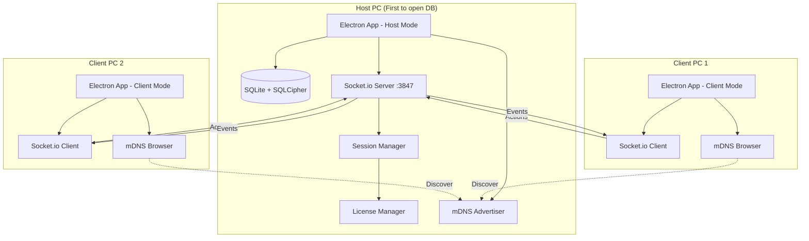
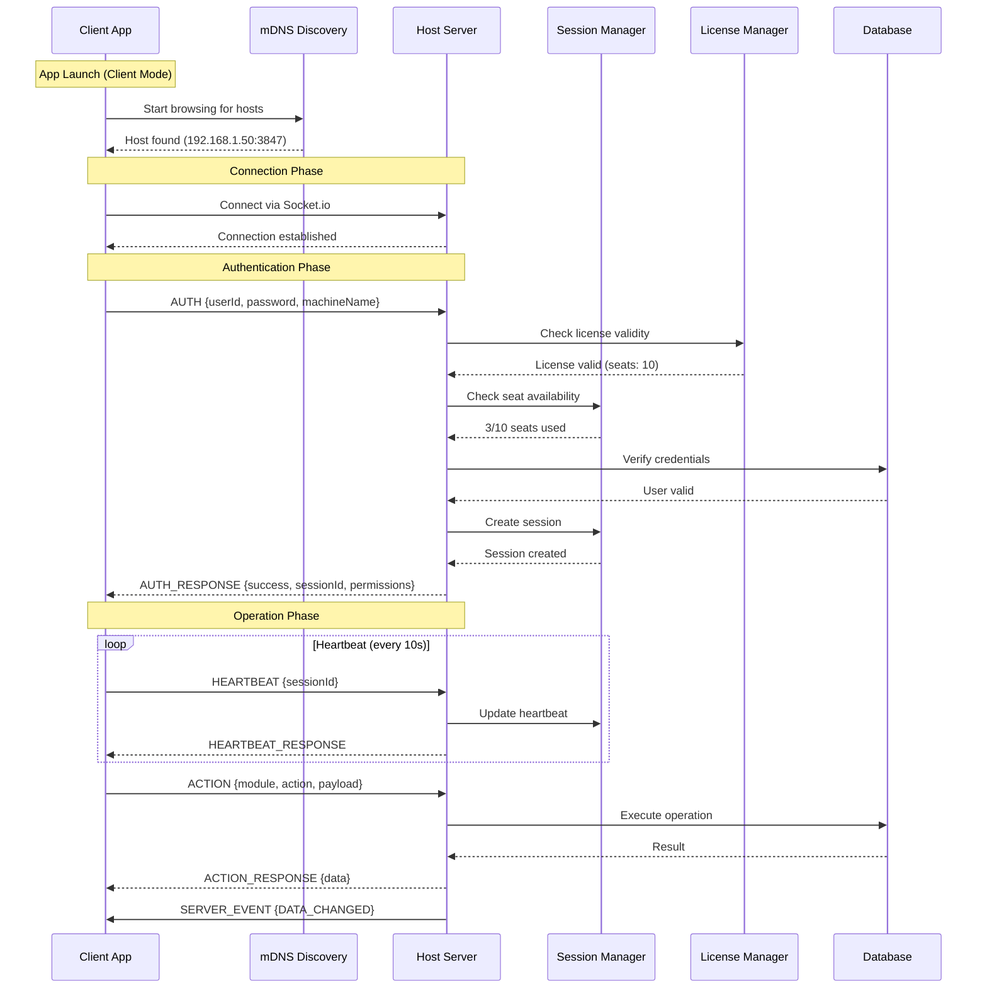
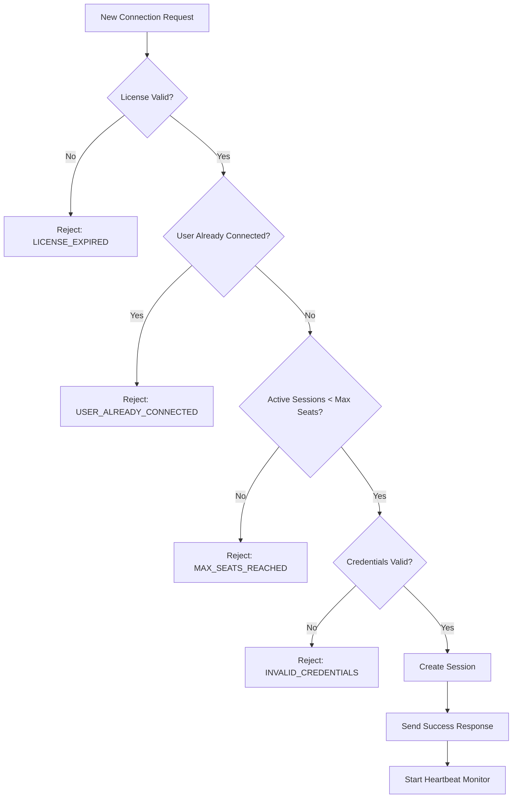
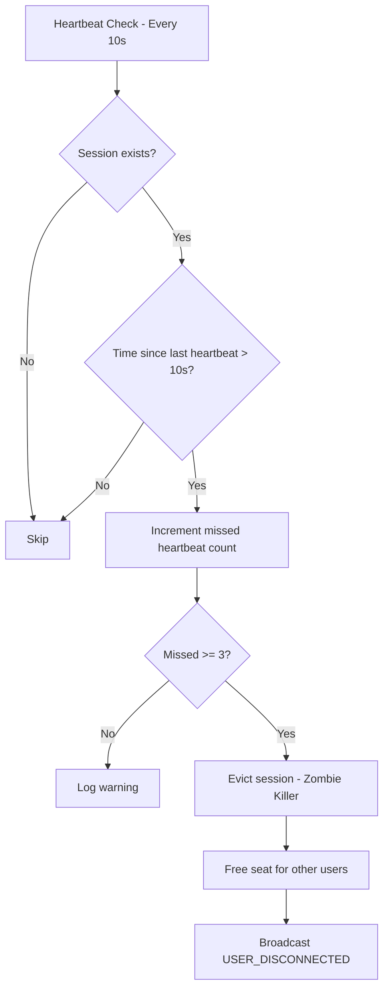

# LAN Multi-User Architecture

## Overview

Stocker Desktop supports multi-user operation over LAN using a Host/Client architecture with dynamic seat enforcement.

## System Architecture

## Host-Client Handshake Flow

## Seat Enforcement Logic

## Zombie Session Cleanup

## Component Details

### Network Manager (`network-manager.ts`)
- Coordinates host/client mode transitions
- Provides unified interface for network operations
- Handles role switching (standalone → host/client)

### Host Server (`host-server.ts`)
- Socket.io server on port 3847
- Handles authentication, heartbeats, and actions
- Broadcasts events to all connected clients
- Integrates with Session Manager and License Manager

### Session Manager (`session-manager.ts`)
- Tracks active client sessions
- Enforces seat limits based on license
- Implements zombie killer (30s timeout, 3 missed heartbeats)
- Provides admin operations (force disconnect)

### LAN Client (`lan-client.ts`)
- Socket.io client for connecting to host
- Handles authentication flow
- Sends heartbeats at 10s intervals
- Executes actions through host

### Discovery Service (`discovery.ts`)
- mDNS-based host discovery (primary)
- UDP broadcast fallback (for Windows without Bonjour)
- Automatic host detection on LAN
- Stale host cleanup

## Protocol Constants

| Constant | Value | Description |
|----------|-------|-------------|
| DEFAULT_PORT | 3847 | Socket.io server port |
| HEARTBEAT_INTERVAL | 10s | Time between heartbeats |
| HEARTBEAT_TIMEOUT | 30s | Max time without heartbeat |
| MAX_MISSED_HEARTBEATS | 3 | Misses before eviction |
| MDNS_SERVICE_TYPE | _stocker._tcp | mDNS service type |

## Message Types

### Client → Host
- `auth` - Authentication request
- `heartbeat` - Keep-alive signal
- `action` - Database/business operation

### Host → Client
- `auth:response` - Authentication result
- `heartbeat:response` - Heartbeat acknowledgment
- `action:response` - Operation result
- `server:event` - Push notifications (data changes, user events)

## Error Codes

| Code | Description |
|------|-------------|
| `INVALID_CREDENTIALS` | Wrong username/password |
| `MAX_SEATS_REACHED` | License seat limit exceeded |
| `USER_ALREADY_CONNECTED` | Same user on another device |
| `LICENSE_EXPIRED` | License not valid |
| `SESSION_EXPIRED` | Session timed out |
| `SERVER_ERROR` | Internal server error |
