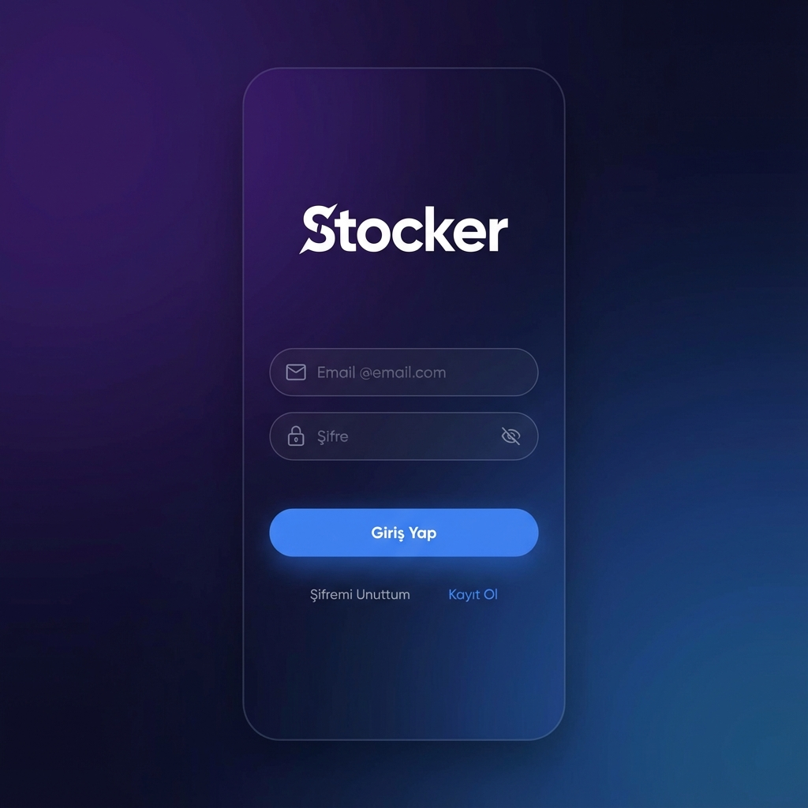
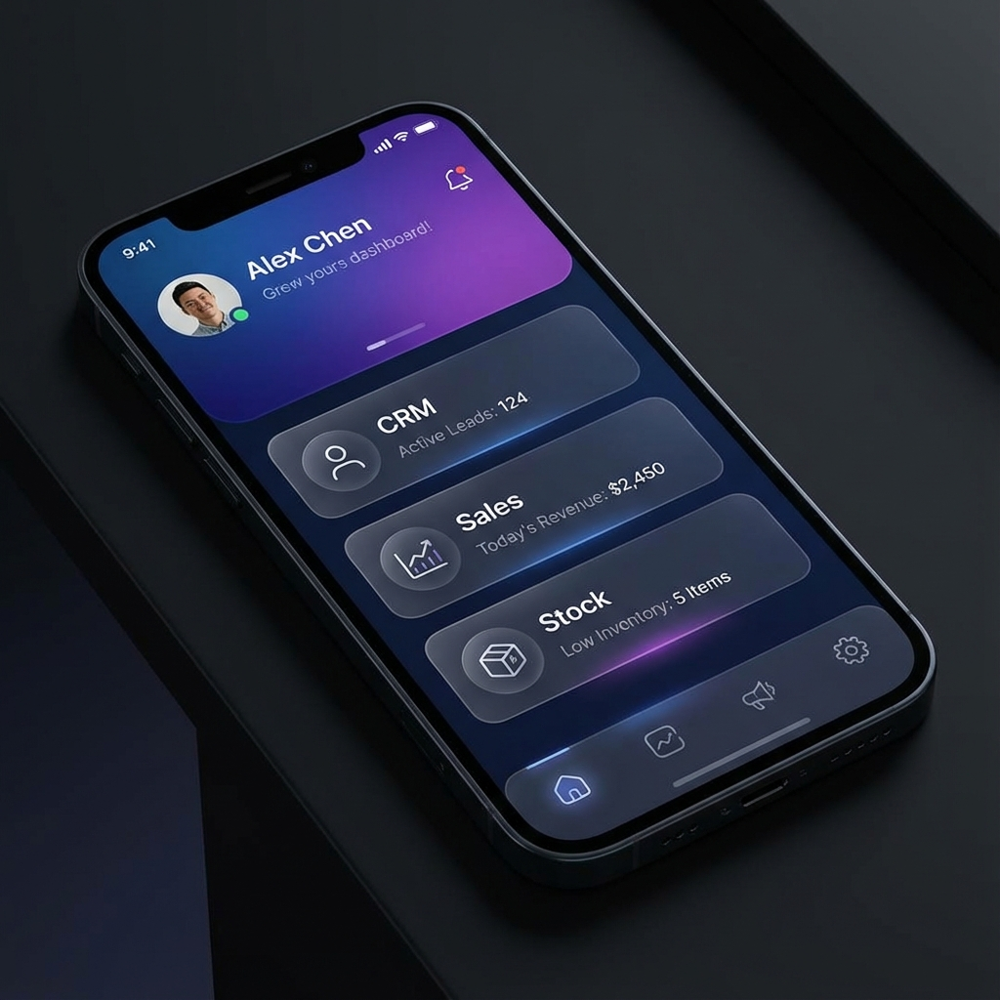
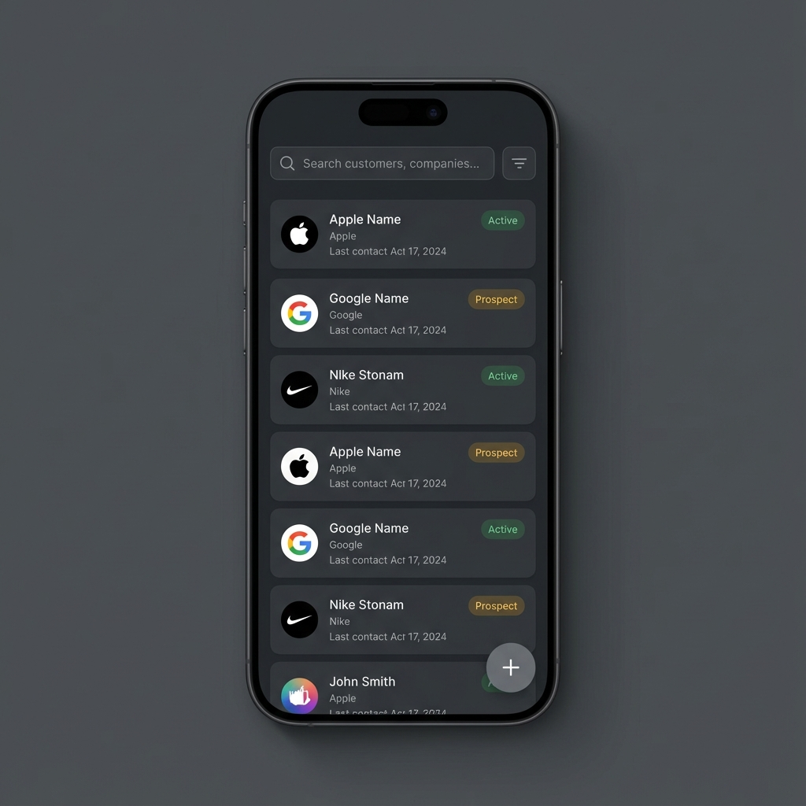
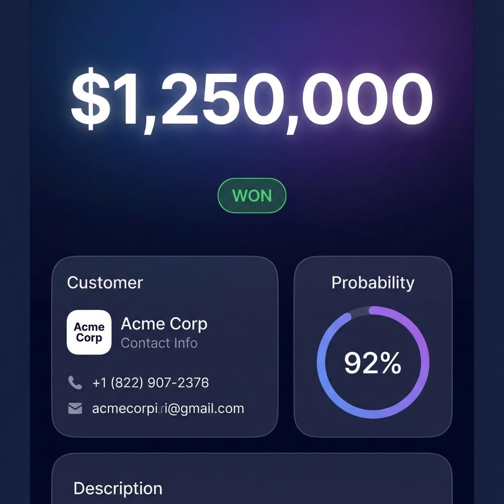

# Stocker Mobile App 📱

Stocker Mobile is a cutting-edge CRM and business management application built with **React Native** and **Expo**. It provides a seamless, premium user experience for managing customers, deals, and business insights on the go.

## 🌟 Visual Showcase

| Login Screen | Dashboard |
|:---:|:---:|
|  |  |

| CRM List | Deal Details |
|:---:|:---:|
|  |  |

## 🚀 Key Features

### 🔐 Advanced Authentication
- **Secure Login**: JWT-based authentication with robust security.
- **SignalR Integration**: Real-time validation during login and registration.
- **Multi-step Registration**: User-friendly onboarding flow.

### 📊 Dynamic Dashboard
- **Modern UI**: Glassmorphism effects and gradient backgrounds.
- **Module Selector**: Easy access to CRM, Sales, Stock, and other modules.
- **Tenant Context**: Automatic handling of tenant-specific data.

### 💼 CRM Module
- **Customer Management**: Add, view, and manage customer profiles.
- **Deal Tracking**: Visualize sales pipeline with detailed deal views.
- **Search & Filter**: Powerful search capabilities for quick access.

## 🛠️ Tech Stack

- **Framework**: [Expo](https://expo.dev) & [React Native](https://reactnative.dev)
- **Language**: [TypeScript](https://www.typescriptlang.org/)
- **Styling**: Custom Theme System & Gradient Effects
- **Animations**: [React Native Reanimated](https://docs.swmansion.com/react-native-reanimated/)
- **Real-time**: [@microsoft/signalr](https://www.npmjs.com/package/@microsoft/signalr)
- **Networking**: Axios

## 🏃‍♂️ Getting Started

1. **Install Dependencies**
   ```bash
   npm install
   ```

2. **Start the App**
   ```bash
   npx expo start
   ```

3. **Run on Device/Emulator**
   - Press `a` for Android Emulator
   - Press `i` for iOS Simulator
   - Scan QR code with Expo Go

---

*Built with ❤️ by the Stocker Team*
